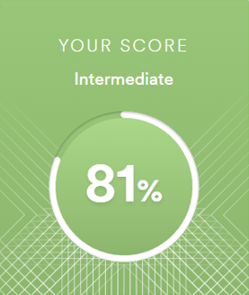

# Ilya Kim

## Contact Information:
### Phone: +998977377135
### E-mail: kim.ilya87@gmail.com
### Telegram: @kilig744
### GitHub: [nvzmjn](https://github.com/nvzmjn) 

## Education and Skills
- Taskent Goverment University of Economy (bachelor degree)
- Plekhanov Russian University of Economics (master degree)
- HTML, CSS (in progress)
- JavaScript (in progress)
- Git/GitHub (in progress)
- RS Schools Course «JavaScript/Front-end. Stage 0» (in progress)

## Languages
- Russian (native)
- English (intermediate B1 according <www.efset.com>) \

